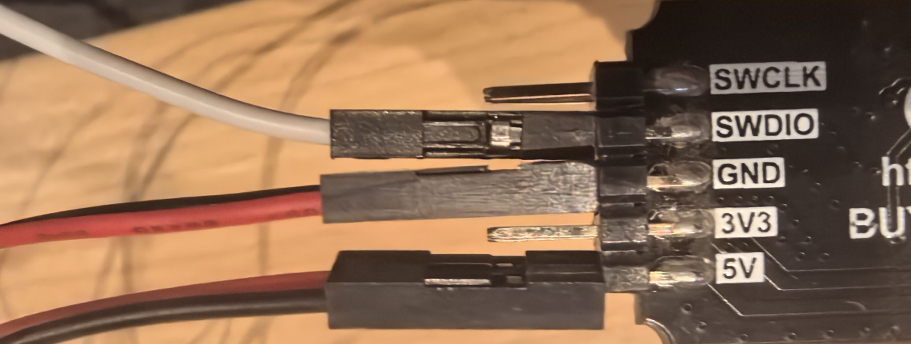
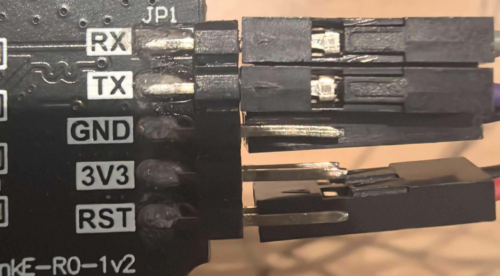

# inspired3D-RV
inspired3d-RISC-V codes

# installation
- Build essentials for building c
  - e.g. use mounriver build tool
# build
- Run `make` in individual directory or build all in root
- Run `make emulator` to build emulator for each program
- Modify [ch32v003fun/ch32v003fun.mk](./ch32v003fun/ch32v003fun.mk) change to prefix to your toolchain
# Program the RISC-V
## Pins required for programming

> swio to swio
> 5v to 5v
> gnd to gnd 
## Pins for Serial communication(uart)

> RX to UTX
> TX to URX

### Note
If you want to develop upon this, you may reference these codes. Mostly **template**
- [**`template`**](./template) for all the basic setup required for developing a new program, using similar structure as arduino  
- [`test_inspire3d_screen_control`](./test_inspire3d_screen_control) for controlling inspired3d screen
- [`test_buttons_detection`](./test_buttons_detection) for button key detection

### Games
- [`pong`](./pong) a pong game
- [`maze`](./maze) a maze game

# TODO
- [x] Basic Button key detection(down or up) 
- [x] Basic LED control
- [x] emulator of inspired3d
- [ ] eeprome read/write
- [ ] Button click detection
- [ ] Intresting games and animations
- [ ] Add more features
